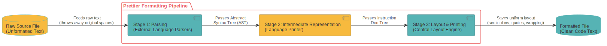

# Overview — Prettier

## Purpose

Prettier is an opinionated code formatter that automatically enforces a consistent style across a codebase, supporting many languages and integrating with most editors. Rather than checking style like a linter, it takes source code as input, discards all original formatting, and reprints it according to its own fixed rules, adjusting indentation, line breaks, and spacing to fit within a configurable print width.
 The problem it solves is as much social as technical: teams waste time in code reviews debating style preferences (tabs vs spaces, trailing commas, quote style). Prettier eliminates that discussion entirely by making one consistent choice for everyone, regardless of editor or environment. This frees developers to focus on what actually matters: writing code, while keeping the entire codebase uniform with minimal effort.

## Roles and Stakeholders

1. **Developers and Development Teams**
    This group represents the primary upstream direct users of the system. They provide the raw, unformatted code strings that serve as the input data for Prettier's core engine. Developers interact with the software through two separate execution channels: text-editor automation during file-save events, and manual command-line interface (CLI) terminal script executions (such as running npm run format) to process entire directories simultaneously. They require high performance and rapid execution speeds to prevent any disruption to their daily development loops.

2. **Code Reviewers**
    
   Code reviewers act as indirect downstream beneficiaries of Prettier's formatting lifecycle. While they do not directly interact with the code execution layer during a review cycle, Prettier's automated enforcement fundamentally changes how their workspace looks on public code hosting platforms like GitHub. By making sure all incoming code follows a project's formatting rules before a Pull Request is even opened, Prettier removes layout and styling differences completely from the code comparison screens. This allows human reviewers to focus entirely on logic, security, and architectural correctness instead of catching formatting mistakes.

3. **Tech Leads**
    
   Tech leads represent the governance boundary of the system at the local project level. They are responsible for choosing to adopt Prettier across a codebase and for creating and maintaining the project's central `.prettierrc` configuration file. Prettier's core engine must dynamically parse this configuration asset at runtime to determine what specific rules (e.g., tab width, trailing commas, or quote styles) to apply during the tree reconstruction phase. Tech leads require absolute rule consistency across software version updates to ensure legacy codebases do not suffer unexpected style regressions.

4. **DevOps and CI/CD Engineers**
    
   DevOps and CI/CD engineers handle the automated testing and deployment of the project. They do not write the application's normal feature code. Instead, their job is to set up automated workflows (like GitHub Actions) that check code updates on cloud servers. They include Prettier in these workflows as an automated gatekeeper by running the `prettier --check` command. This command scans the code and returns an error flag if any file is unformatted, programmatically blocking bad code from being merged into the main branch. Because of this, they care deeply about Prettier's speed and its ability to stop the pipeline when rules are broken.

5. **Editor Plugin Maintainers**
    
   Editor plugin maintainers are downstream adapters who connect third-party text editors (_like VS Code, IntelliJ, and Vim_) to Prettier's formatting logic. Architecturally, these integrations do not run terminal commands. Instead, they use extension wrappers that talk directly to Prettier's programmatic _Node.js API_ inside `src/main/.` Because of this setup, they rely completely on Prettier keeping its public API stable and reliable so that core engine updates do not cause millions of editor extensions to crash.

6. External Plugin Developers
    
   External plugin developers are community contributors who extend Prettier to support extra languages like _PHP, Ruby, or Java_. They do not modify Prettier's core source files directly. Instead, they use Prettier’s public Plugin API to register custom, third-party parsers and printers straight into the main formatting pipeline.

7. Core Open-Source Contributors & Developers
    
   This internal group maintains Prettier’s source code on GitHub. They manage software releases, fix issues, and review pull requests. Architecturally, their main goal is to keep high cohesion inside individual folders and a clean separation between the core engine `(src/main/, src/doc/)` and the language modules `(src/language-\*)`. This decoupled setup ensures they can fix a bug in one language module without accidentally breaking the rest of the system.

## System Description

Prettier is a JavaScript and TypeScript-based project distributed as an _npm package_, supporting a wide range of languages including _JavaScript, TypeScript, CSS, HTML, Markdown, GraphQL, and YAML_. At its core, it implements a strict one-way **three-stage pipeline**; original source formatting is discarded entirely at the parsing stage, meaning the output is always determined by Prettier's rules alone.

- **Parsing**: Source code is parsed into an Abstract Syntax Tree (AST) using a language-specific parser. Prettier relies on established parsers such as _Babel_, the _TypeScript_ compiler, and _PostCSS_ depending on the file type. 
- **Intermediate representation**: The **AST** is passed to a printer, which converts it into an intermediate "doc" — a tree of abstract formatting instructions rather than plain text.
   
- **Layout**: A centralized layout algorithm walks the doc tree and determines what fits on a single line within the configured print width, introducing line breaks only where necessary.
   

The codebase is organized around _8 language modules_, each living in its own `src/language-*/` directory, with dedicated parsers and printers kept self-contained per language. A shared `src/doc/` module provides the layout algorithm that all language modules rely on. A `src/main/` coordination layer loads user configuration and selects the correct parser and printer based on file type. The command-line interface lives in `src/cli/`, deliberately decoupled from the core engine so the same formatting logic can be invoked from a terminal, an editor plugin, or a CI pipeline without modification.

## Code Statistics

| Metric                              | Value          |
| ----------------------------------- | -------------- |
| Lines of code (`src/` only)         | 37,457         |
| Total files (`src/`)                | 523            |
| Language modules (`src/language-*`) | 8              |
| Contributors                        | 805            |
| Total commits                       | 11,194         |
| Primary language                    | JavaScript     |
| Last commit                         | April 30, 2026 |

_Statistics gathered using `cloc` and `git` on the main branch._

