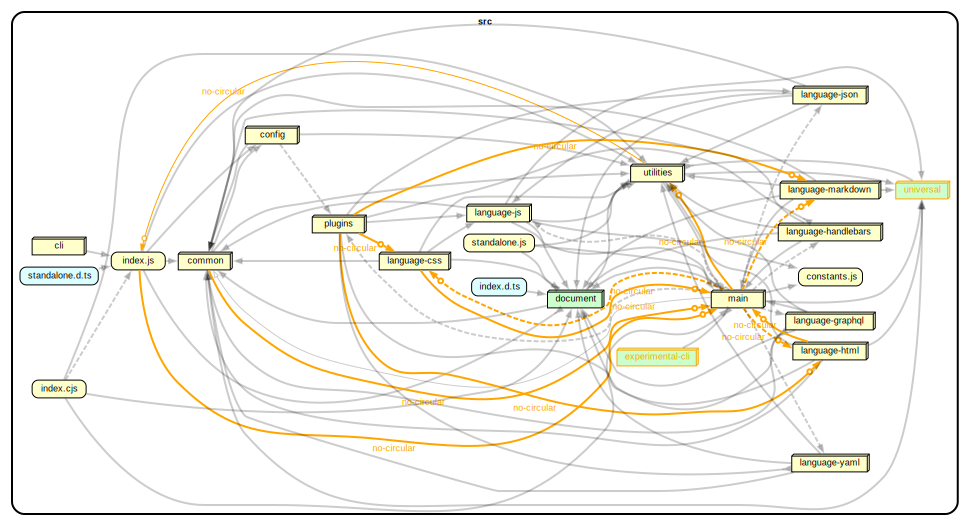
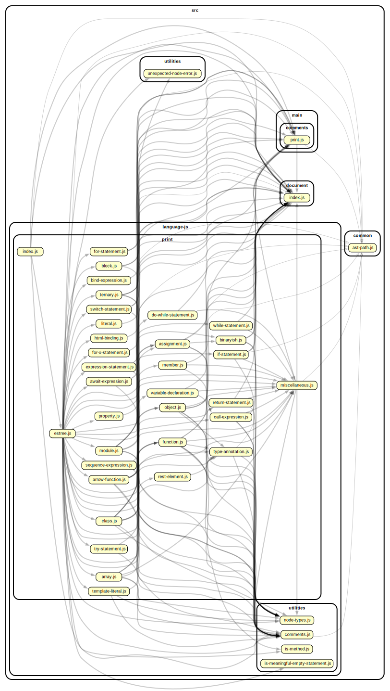
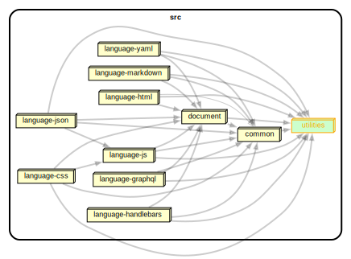

## 1. Code Dependencies Analysis

### 1.1 Methodology and Tools

We used `dependency-cruiser`, a Node.js tool that reads `import` and `require` statements in the source code without running it, on the `src/` folder of Prettier:

```bash
npx depcruise src --output-type json > dependency_data.json
```

This produced a JSON file with every module and the modules it imports. A short script then computed two numbers for each file:

- **Out-degree**: how many other files it imports.
- **In-degree**: how many other files import it.

The cruise covered **537 modules** and **1,829 dependency edges**, with no unresolved imports.

All diagrams in this section were drawn from the same JSON, using Graphviz (`dot`) with two `dependency-cruiser` reporters: `archi` for folder-level views and `dot --focus` for module-level views.

### 1.2 Analysis of Most Dependent Files (High Out-degree)

**Table 1 – Top 5 files by out-degree.**

| Rank | File | Out-degree | Functional role |
|------|------|-----------:|-----------------|
| 1 | `src/language-js/print/estree.js` | 41 | Dispatcher for the ESTree (JavaScript) AST printer |
| 2 | `src/language-js/print/flow.js` | 39 | Dispatcher for the Flow type-system AST printer |
| 3 | `src/language-js/print/typescript.js` | 34 | Dispatcher for the TypeScript AST printer |
| 4 | `src/document/builders/index.js` | 28 | Barrel re-export aggregating all document builders |
| 5 | `src/main/plugins/builtin-plugins/production-plugins.js` | 28 | Registration table for built-in language plugins |

The top three files are all *printers*. They take a piece of parsed code (an AST node) and decide how to print it. Each one imports a separate sub-printer for every kind of node (classes, objects, function calls, etc.), which is why they have so many imports. This keeps each sub-printer small and easy to test.

The other two files have many imports for a different reason. `document/builders/index.js` is a "barrel" file that just re-exports the public API of the document module. `production-plugins.js` simply lists all eight built-in language plugins so the rest of the system can find them. They are not complex — they just collect things together. The main entry point `src/index.js` works the same way with 17 imports.

### 1.3 Analysis of Least Dependent Files

108 files (≈20% of the codebase) import nothing, and another 126 import only one file. Five examples are shown below.

**Table 2 – Selected low out-degree modules.**

| File | Out-degree | In-degree | Rationale |
|------|-----------:|----------:|-----------|
| `src/utilities/is-non-empty-array.js` | 0 | 29 | Pure predicate; widely used leaf utility |
| `src/common/parser-create-error.js` | 0 | 15 | Single-purpose error constructor |
| `src/document/builders/types.js` | 0 | 18 | Type/constants definitions, no logic |
| `src/language-css/utilities/is-scss-variable.js` | 0 | 1 | SCSS-specific predicate, used only by the CSS plugin |
| `src/language-yaml/loc.js` | 0 | 2 | YAML-local source-location helper |

These files show two kinds of modularity. Some, like `is-non-empty-array.js`, are tiny generic helpers used everywhere — they have no imports so they can be reused without dragging extra code along. Others, like `is-scss-variable.js` or `loc.js`, are very specific helpers used by only one language plugin. A few files (`experimental-cli/index.js`, `universal/index.browser.js`) are alternative entry points not reached from the main CLI.

### 1.4 Central Modules (High In-degree)

**Table 3 – Top files by in-degree.**

| File | In-degree | Role |
|------|----------:|------|
| `src/document/index.js` | 157 | Public surface of the document IR (builders, printer, utilities) |
| `src/language-js/types/estree.d.ts` | 55 | Shared AST type declarations |
| `src/language-js/utilities/node-types.js` | 55 | AST node-type predicates |
| `src/common/ast-path.js` | 46 | Cursor for traversing ASTs |
| `src/language-js/utilities/comments.js` | 39 | Comment-attachment utilities |
| `src/language-js/location/index.js` | 36 | Source-location helpers |
| `src/utilities/is-non-empty-array.js` | 29 | Generic predicate |

`src/document/index.js` stands out: 157 files import it, which is about 8.6% of all dependency edges in the project. This file is the *backbone* of Prettier — every printer in every language plugin uses it to build its output. The other files are small AST helpers and predicates used widely across the project.

### 1.5 Summary of Code Dependencies Findings

The dependency graph is very uneven. A small core (the document module, AST helpers, and a few generic predicates) is imported by many files, while most of the codebase consists of small files with few imports and few users. The files with many imports are either *printers* (one import per AST node type) or *barrel/registry* files that just collect things together.

The most important observation is that the eight `language-*` folders contain 391 of the 537 files (≈73%), but they share almost no imports with each other. They only connect through the common core. This is the typical shape of a **plugin-based architecture**: a stable shared core plus independent language plugins.

### 1.6 Visual Evidence



**Figure 1 – Folder-level dependency overview.** Each node is a top-level folder under `src/`; edges show imports between folders. Reducing 537 files to ~15 folders makes the big picture clear: a small core (`document`, `common`, `utilities`) sits in the middle, the eight `language-*` folders hang off it as parallel branches, and the entry layers (`main`, `cli`, `index.js`) sit on top. The graph is layered, not tangled.



**Figure 2 – Out-degree exemplar: `src/language-js/print/estree.js`.** Built with `--focus` on the file with the highest out-degree, the diagram shows the printer at the centre with arrows going out to 41 sub-printers (`class.js`, `member-chain.js`, `object.js`, …) and shared utilities. The shape — one hub, many leaves, no arrows coming back — is the typical look of a dispatcher and supports the point in §1.2: many imports come from covering many AST node types, not from real complexity.



**Figure 3 – Plugin isolation view.** A folder-level diagram showing only `language-*`, `document`, `common`, and `utilities`. Every `language-*` box has arrows going *into* the core, but **no arrows between `language-*` boxes**. This confirms the conclusion of §1.5: language plugins do not depend on each other, only on the shared core — the structural signature of a plugin-based architecture.

## 2. Knowledge Dependencies Analysis

### 2.1 Methodology and Tools

We used `git log` to extract every commit from the Prettier repository in the last 12 months (May 2025 – May 2026), keeping only changes to source files (`.js`, `.ts`, `.d.ts`) inside `src/`:

```bash
git log --since="2025-05-13" --pretty=format:"COMMIT:%H" \
        --name-only --no-merges -- 'src/*'
```

A Python script then counted, for each pair of files, how many times they were modified in the same commit. Commits touching more than 20 files were ignored (mass-rename commits create fake coupling). For each pair (A, B) we computed:

$$\text{coupling}(A, B) = \frac{\text{co\_changes}(A, B)}{\min(\text{changes}(A),\ \text{changes}(B))}$$

A score close to 1 means the two files almost always change together. We kept only pairs with at least 5 co-changes. The result was then compared with the static dependency graph from §1 to see which co-changing pairs actually import each other and which do not.

The window contains **459 commits** and produces **24 pairs** above the threshold. The sample is small but workable, and most pairs come from `language-js` because it is the most active part of the project.

### 2.2 Top Knowledge-Coupled File Pairs

**Table 4 – Top 10 co-changing file pairs (support ≥ 5).**

| Rank | File A | File B | Co-changes | Coupling | Import edge? |
|------|--------|--------|-----------:|---------:|:------------:|
| 1 | `language-js/print/function.js` | `language-js/print/hook.js` | 5 | 0.62 | ✗ |
| 2 | `language-js/loc.js` | `language-js/parse/postprocess/index.js` | 6 | 0.60 | ✗ |
| 3 | `language-js/loc.js` | `language-js/print/ignored.js` | 6 | 0.60 | ✗ |
| 4 | `language-js/parse/acorn.js` | `language-js/parse/babel.js` | 7 | 0.58 | ✗ |
| 5 | `language-js/parse/espree.js` | `language-js/parse/meriyah.js` | 5 | 0.56 | ✗ |
| 6 | `language-js/parse/postprocess/index.js` | `language-js/print/ignored.js` | 6 | 0.55 | ✗ |
| 7 | `language-js/print/arrow-function.js` | `language-js/print/function-parameters.js` | 5 | 0.50 | ✓ |
| 8 | `language-js/print/flow.js` | `language-js/print/typescript.js` | 9 | 0.43 | ✗ |
| 9 | `language-js/types/estree.d.ts` | `language-js/utilities/index.js` | 6 | 0.43 | ✗ |
| 10 | `language-js/parse/acorn.js` | `language-js/parse/oxc.js` | 5 | 0.42 | ✗ |

Out of 24 pairs, only **6 (25%)** have a direct import edge. The other **18 (75%)** change together but do not import each other — these are the pairs the static analysis misses.

### 2.3 Inconsistencies with Code Dependencies

The inconsistent pairs fall into three groups.

**Parallel parsers (rows 4, 5, 10).** The files `acorn.js`, `babel.js`, `espree.js`, `meriyah.js`, and `oxc.js` are all wrappers around different external JavaScript parsers. They don't import each other because they are interchangeable, but when something changes in how Prettier talks to a parser, all of them must be updated at the same time.

**Parallel printers (rows 1, 8).** `function.js` and `hook.js` print very similar code (React hooks are just a kind of function), and `flow.js` and `typescript.js` print two type systems that share most of their syntax. They don't import each other, but a change in one usually means a similar change in the other.

**Parse and print sharing the same data (rows 2, 3, 6, 9).** `loc.js` deals with source-code positions, and so do `postprocess/index.js` and `ignored.js`. They don't import each other but they all rely on the same idea of where things are in the source file, so they change together. The same happens with `estree.d.ts` (AST types) and `utilities/index.js` (functions that use those types).

Only one pair (row 7, `arrow-function.js` and `function-parameters.js`) is **consistent**: they import each other and also change together, which is the normal case.

### 2.4 Summary of Knowledge-Dependency Findings

The main result is that **75% of the strongest co-changing pairs have no import edge between them**. This means the static dependency graph misses a large part of the real coupling in the codebase. Most of the missing coupling happens inside `language-js`, around three implicit "contracts" — the parser interface, similar printers for related languages, and shared source-location data — that are not represented as real shared modules. Turning these into explicit modules would make the hidden coupling visible in the code. This does not contradict §1.5: the plugins are still cleanly separated from each other, but inside the largest plugin some abstractions are still missing.


# **Design Pattern Usage in Prettier’s Formatting Pipeline**

## Overview
Prettier implements a multi‑stage formatting pipeline that transforms unformatted source code into a deterministic, standardized output. Each stage corresponds to a distinct software design pattern, enabling modularity, extensibility, and maintainability. The four major stages are:
| Stage | What Prettier does | Pattern |
| ------------- | ------------------- | --------- |
| **1 Parsing** | Converted text → AST using Babel | **Strategy** |
| **2 AST traversal** | Visited nodes and generated Doc IR | **Visitor** |
| **3 Doc** | Built a tree of formatting primitives | **Composite** |
| **4 Printing** | Applied line‑breaking algorithm | **Interpreter** |

An example of an input code badly formatted is:

```js
function add(a, b) {return a + b;
}
```
Prettier transforms this function into a standardized format which looks like this:
```js
function add(a, b) {
  return a + b;
}
```
---

## **Stage 1. Strategy Pattern**

Prettier selects the right parser (from the implemented one) to transform the original text (code) in an AST (Abstract Syntax Tree).
Prettier does not parse the code, instead it calls external parser, which can be found in `src/language-js/parse` directory, or in general `src/language-to-parse/parse` directory.

### **Key classes / Functions**

| Role | Implementation |
| ------ | ---------------- |
| **Context** | `parse()` in `src/main/parse.js` |
| **Strategy Selector** | `resolveParser()` in `src/main/parser-and-printer.js` |
| **Concrete Strategies** | Each parser file in `src/language-js/parse/*.js` |
| **Strategy Interface** | All parsers expose `parse(text, options)` |

### **Why is it used:**

Prettier must support many languages and syntaxes.  
Using **Strategy** allows:

- interchangeable parsers  
- plugin‑based extensibility  
- no changes to the core when adding new languages  

Without **Strategy**, Prettier would require a massive `switch(parserName)` or duplicated logic, so it helps by isolating variability and keeping the core stable.

### **Alternative:**

A monolithic parser supporting all languages.  

**Pros:**  

- Single codebase  
- Potentially faster integration  

**Cons:**  

- Impossible to maintain  
- Hard to support evolving language features  
- No plugin ecosystem  

### **The AST looks like this:**

```
Program
 └─ body
     └─ FunctionDeclaration
         ├─ id: Identifier("add")
         ├─ params:
         │    ├─ Identifier("a")
         │    └─ Identifier("b")
         └─ body: BlockStatement
               └─ ReturnStatement
                     └─ BinaryExpression("+")
                           ├─ Identifier("a")
                           └─ Identifier("b")
```

---

## **Stage 2. Visitor Pattern**

Prettier visit the AST recursively to generate a Doc object.

### **Key classes / functions:**

| Role | Implementation |
| ------ | ---------------- |
| **Element** | AST nodes (Identifier, FunctionDeclaration, etc.) |
| **Visitor** | Printer functions (`printEstree`, `printFunction`, `printBinaryishExpression`, etc.) |
| **Traversal Engine** | `AstPath`, `mainPrint()`, `path.call()` |
| **Client** | `printAstToDoc()` in `src/main/ast-to-doc.js`|

### **Why is it used:**

ASTs contain many node types, each requiring different formatting logic.  
**Visitor** allows:

- adding new node types without modifying the AST  
- separating structure (AST) from behavior (printing)  
- recursive traversal with consistent context (`AstPath`)  

Embedding formatting logic inside AST nodes is impossible because ASTs come from external parsers (Babel, TypeScript, etc.) so **Visitor** is the perfect choice because it cleanly decouples the two worlds.

### **Alternative:**

Large `switch(node.type)` blocks scattered throughout the code.

**Pros:**  

- Simple to implement initially  

**Cons:**

- Hard to maintain  
- No separation of concerns  
- No plugin extensibility  

---

## **Stage 3. Composite Pattern**

Now Prettier generates the **Doc** object, which is the internal tree structure representing the formatted code before printing.

### **Key classes / functions:**

| Role | Implementation |
| ------ | ---------------- |
| **Component** | Doc nodes (`Doc` type) |
| **Composite** | `group`, `indent`, `concat` |
| **Leaf** | `line`, `softline`, strings |
| **Client** | Printer in `document/printer/printer.js` |

### **Why is it used:**

Doc IR must represent:

- nested structures  
- indentation  
- line‑breaking decisions  
- grouping of logical units  

**Composite** allows Prettier to treat:

- a single string  
- a line break  
- a group of nodes  

all with the same interface.

Without **Composite**, Prettier would need ad‑hoc logic for every formatting case, so it provides a uniform tree structure that the printer can traverse recursively.

### **Alternative**

Generate strings directly during AST traversal.

**Pros:**  

- Simpler implementation  

**Cons:**  

- Impossible to implement smart line breaking  
- No global optimization  
- No consistent indentation model  

**Composite** is essential for Prettier’s “formatting as optimization” approach.

### **The Doc IR for the example function looks like this:**

```
group([
  "function ",
  "add",
  "(",
  group(["a", ",", line, "b"]),
  ") ",
  group([
    "{",
    indent([
      hardline,
      "return ",
      group(["a", " + ", "b"]),
      ";"
    ]),
    hardline,
    "}"
  ])
])
```

---

## **Stage 4. Interpreter Pattern**

In the final stage, Prettier converts the Doc into the final formatted string.  
This step is implemented in `src/document/printer/printer.js`, which acts as an **Interpreter** for the Doc language.

### **Key classes / functions:**

| Role | Implementation |
| ------ | ---------------- |
| **Interpreter** | `printDocToString()` |
| **Language symbols** | `DOC_TYPE_GROUP`, `DOC_TYPE_LINE`, `DOC_TYPE_INDENT`, `DOC_TYPE_FILL`, `DOC_TYPE_STRING`, etc. |
| **Execution context** | `mode` (FLAT/BREAK), `indent`, `groupModeMap` |
| **Semantic rules** | `fits()`, line breaking logic, indentation logic |

### **Why it is used:**

Prettier defines a **formal intermediate language** (Doc) to describe formatting decisions.  
The printer must:

- interpret each Doc node  
- apply semantic rules (line breaking, indentation, flattening)  
- produce the final string deterministically  

This is exactly the purpose of the **Interpreter** pattern:

> *Define a language and interpret its sentences using an interpreter.*

Without **Interpreter**:

- formatting rules would be scattered across the codebase  
- line breaking would be ad‑hoc and inconsistent  
- indentation logic would be duplicated  
- plugins could not rely on a stable printing model  

**Interpreter** centralizes all formatting semantics in one place.

### **Alternative:**

Hard‑code formatting logic directly in the AST visitor.

**Pros:**  

- Simpler initial implementation  

**Cons:**  

- Impossible to implement global line‑breaking optimization  
- No separation between structure (AST) and formatting semantics  
- No Doc IR → no plugin extensibility  
- Harder to maintain and evolve  

Interpreter is essential for Prettier’s deterministic formatting model.


---

