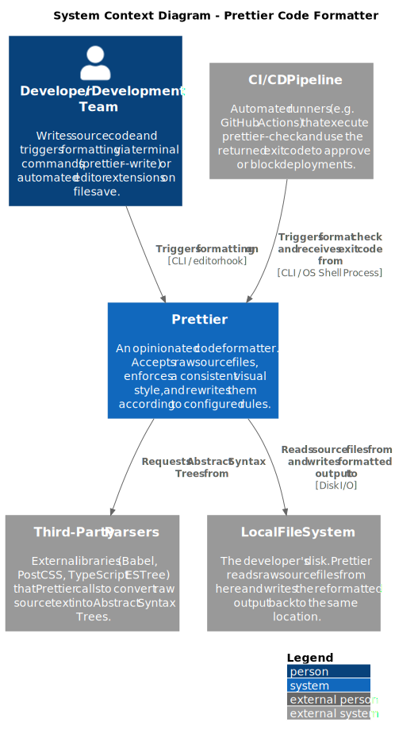

# 1. System Context Level Analysis

## 1.1 System Operational Scope and Boundaries

The scope of Prettier is strictly limited to fixing and formatting the visual style of source code files. Unlike traditional code linters (such as _ESLint_), it has no access to logical bug detection or code quality metrics.

### External Boundaries (_Inputs & Outputs_)

To maintain a clean, one-way flow of data, Prettier interacts with its environment through specific entry and exit points:

- **The Input Boundary** &rarr; Prettier reads raw source files directly from the local file system via _Disk I/O_. It also calls external language parsers to convert that raw source text into a readable code tree map.
- **The Output Boundary** &rarr; Prettier writes the reformatted output back to the same location on the local file system via _Disk I/O_. In automated CI/CD environments, it returns a process status flag (exit code) to the pipeline runner that triggered it.

## 1.2 Users and Consumer Systems

The system is run directly by one main human actor who interacts across Prettier's external boundary line:

- **Developers and Development Teams** &rarr; The primary users who supply raw code text to the system. They interact with Prettier daily through automated text-editor extensions when saving files (_editor hook_), or by running manual terminal commands like `prettier --write` to format multiple folders at once (_CLI_).

## 1.3 How the System Interacts with its Environment

Prettier interacts with outside systems in its environment through the following inputs and outputs:

- **External Parsers** (Babel, PostCSS, TypeScript ESTree) &rarr; Prettier calls these outside libraries to convert raw source text into a readable code _tree map (AST)_ so the engine can understand its structure.

- **Local File System** &rarr; Prettier has a two-way interaction with the developer's disk via _Disk I/O_. It first reads the raw source files from their location, then writes the clean, reformatted output back to that same location when running `prettier --write`.

- **CI/CD Pipelines** &rarr; In automated CI/CD environments, the pipeline triggers Prettier by running `prettier --check` to validate code style compliance. Prettier responds by returning a success or failure flag (exit code) through the _CLI / OS Shell Process_ to approve or block code deployments.

# 2 Container Diagram Explanation

The container diagram focuses on Prettier’s core formatting pipeline and refines the external interactions already shown in the Context Diagram.

Inside Prettier, the architecture is decomposed into five main containers: 
- CLI, Node.js API
- Formatting Core 
- Language Plugins 
- Document Module. 
The diagram also shows the external systems involved in the same workflow: Developers and Feature Teams, CI/CD Pipelines, Third-Party Parsers, and the Local File System.

The CLI and Node.js API are the two entry points of the system. The CLI receives terminal commands such as `prettier --write` or `prettier --check`, while the Node.js API exposes programmatic access through calls such as `prettier.format()`. Both entry points forward source text, file paths, and resolved options to the Formatting Core.

The Formatting Core acts as the central orchestrator of the workflow. It resolves options, selects the appropriate language plugin, invokes the configured parser and printer, and coordinates formatted output generation. It does not embed language-specific formatting rules directly.

Language-specific behavior is isolated inside the Language Plugins container. Each plugin provides parsers and printers for languages such as JavaScript, TypeScript, HTML, CSS, and Markdown. Plugins invoke External Parsers, such as Babel, TypeScript ESTree, and PostCSS, through parser library calls to transform raw source text into an Abstract Syntax Tree (AST).

The Document Module builds and renders Prettier’s intermediate document representation. This representation models indentation, grouping, line wrapping, and layout decisions before being rendered into final formatted text.

The Local File System is used by the CLI through disk I/O: source files are read as input and, in write mode, formatted text is written back to disk. In CI/CD environments, the pipeline invokes the CLI through an OS shell process, typically using `prettier --check`, and receives an exit code indicating whether the formatting check passed or failed.

The overall workflow is:
1. a formatting request arrives through the CLI or Node.js API;
2. the Formatting Core receives source text, file paths, and resolved options;
3. the Core selects and invokes the appropriate Language Plugin;
4. the plugin uses External Parsers to generate an AST;
5. the plugin builds a document representation through the Document Module;
6. the Document Module renders formatted text;
7. the Core returns formatted text, diagnostics, or an exit status to the entry point.

This decomposition keeps the architecture modular and extensible: the Core coordinates the process, plugins isolate language-specific behavior, and the Document Module centralizes layout decisions.

# 3 Component

For Level 3 we zoomed into the **Formatting Core**, since it is the container that actually drives the pipeline. The other containers around it (CLI, Node.js API, Language Plugins, Document Module, Third-Party Parsers) appear on the diagram as flat boxes only — we did not open them — because the Formatting Core's components send method calls to them, and the reader needs to see what crosses the dashed boundary.

Inside the Formatting Core we identified four components:

- **Options Resolver** — merges the user's config (`.prettierrc`, CLI flags) with Prettier's defaults. It runs first because every other component needs the resolved options.
- **Parser Dispatcher** — picks the right Language Plugin based on file type and forwards parsing to it. The plugin in turn calls the third-party parsers (Babel, TypeScript, PostCSS) and returns an AST.
- **AST Post-processor** — normalises the AST so the rest of the pipeline sees a uniform shape regardless of which parser produced it.
- **Printer Dispatcher** — walks the normalised AST and asks the Document Module to build the intermediate document representation (`group()`, `indent()`, `line()` calls), then returns the final formatted text back to the CLI or API.

**Discarded containers.** We chose to zoom only into the Formatting Core because the other containers are too thin or too repetitive to be worth opening: the CLI just parses arguments and calls the core, the Node.js API exports a single `format()` function, the Document Module is essentially a set of small builders already covered in section1.4, and the eight Language Plugins all share the same internal shape so drawing one would be representative but drawing all of them would clutter the report.

### 3.1 SOLID at the Component Level

**SRP** — mostly respected, with one weak point: the **Printer Dispatcher** both walks the AST *and* dispatches each node to the right sub-printer. This is the same observation as section1.2, where the corresponding file had the highest out-degree (41 imports) in the project. Splitting traversal from dispatch would be a clean refactoring.

**OCP** — well respected by the Parser Dispatcher: adding a new parser (like the recent `oxc` parser) only requires a new entry in the dispatch table, with no changes to existing code.

**DIP** — partly respected. The core depends on parsers through adapters, but our knowledge-dependency analysis (section2.3) showed that the five parser adapters co-change without importing each other, meaning the shared contract is implicit. Making it an explicit interface would make the inversion real.

**LSP and ISP** — no violations worth reporting; the interfaces between components (options, AST, IR) are narrow and focused.

Overall, the component design is clean. The main finding is consistent with the rest of the report: the dispatchers do slightly too much, and the parser contract should be made explicit.
