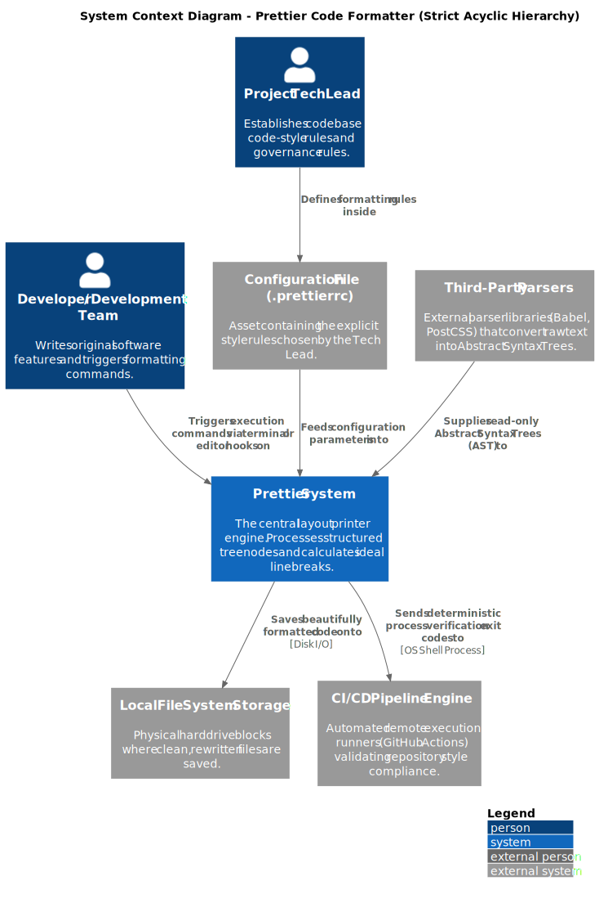
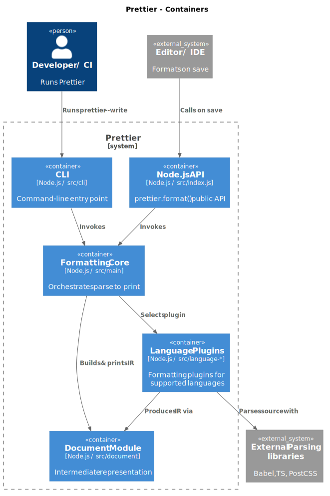
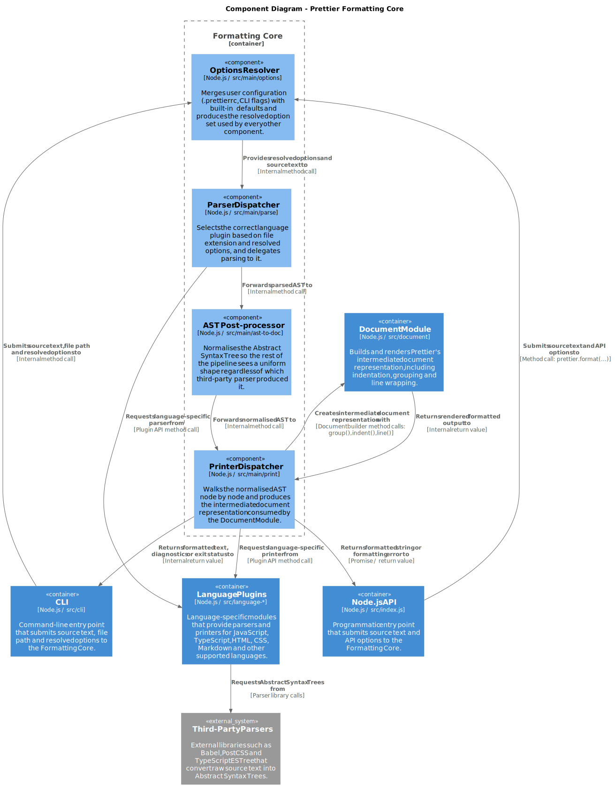

# 1. System Context Level Analysis

## 1.1 System Operational Scope and Boundaries

The scope of Prettier is strictly limited to fixing and formatting the visual style of source code files. Unlike traditional code linters (such as *ESLint*), it has no access to logical bug detection or code quality metrics.

### External Boundaries (*Inputs & Outputs*)

To maintain a clean, one-way flow of data, Prettier interacts with its environment purely through specific entry and exit points:

- **The Input Boundary** &rarr; Prettier reads the user's chosen style rules from a local configuration file `(.prettierrc)`. It also accepts a read-only code tree map from external language parsers.
- **The Output Boundary** &rarr; Prettier overwrites local files with clean, formatted text strings. In remote cloud tests, it passes a process status flag (*exit code*) to stop or approve code deployments.

## 1.2 Users and Consumer Systems

The system is run directly by two main human actors who interact across Prettier’s external boundary line:

- **Developers and Feature Teams** &rarr; The primary users who supply raw code text to the system. They interact with Prettier daily through automated text-editor extensions when saving files, or by running manual terminal commands (like `prettier --write)` to format multiple folders at once.
- **Project Tech Leads** &rarr; Manage the formatting rules without running the tool themselves. They operate at the project setup level by deciding to use Prettier for their repository. They establish the official style guidelines by creating and maintaining the central `.prettierrc` configuration file.

## 1.3 How the System Interacts with its Environment

Prettier interacts with outside systems in its environment through simple, one-way inputs and outputs:

- **Configuration File** (`.prettierrc`) &rarr; Prettier reads this local file when it starts up to get your chosen style rules, like tab _widths or quote types_.

- **External Parsers** (Babel, PostCSS, TypeScript ESTree) &rarr; Prettier relies on these outside libraries to turn raw code text into a readable code _tree map (AST)_ so the engine can understand its structure.

- **Local File System** &rarr; When you run a format command (like `prettier --write`), the system saves the clean, rewritten code text directly back to your hard drive.

- **CI/CD Pipelines** &rarr; In automated cloud environments, Prettier checks if code matches your style rules using `prettier --check`. It interacts directly with the _OS shell process_ by sending a success or failure flag (exit code) to the pipeline runner to approve or block code deployments.

# 2. Container Diagram Explanation

The container diagram focuses on the core formatting pipeline of Prettier, which represents the most important architectural part of the system.

The architecture was decomposed according to functional responsibilities into five main containers:
- CLI/API Layer
- Formatting Core
- Language Plugins
- Document Module
- External Parsing Libraries

The CLI and API containers represent the external access points of the system. The CLI allows developers to format code directly from the terminal, while the API exposes programmatic access through functions such as `prettier.format()`.

The Formatting Core acts as the central orchestrator of the formatting workflow. Its responsibilities include:
- selecting the appropriate parser and printer;
- coordinating plugin execution;
- managing the formatting pipeline.

Language-specific logic is isolated inside the Language Plugins container. Each plugin provides parsers and printers dedicated to a specific language such as JavaScript, TypeScript, HTML, CSS, or Markdown. This separation improves modularity and extensibility because support for new languages can be added without modifying the core logic of the system.

The plugins rely on third-party parsing libraries such as Babel and TypeScript ESTree to generate Abstract Syntax Trees (ASTs). These ASTs are then traversed and processed by the formatting logic.

The Document Module is responsible for generating the intermediate document representation used internally by Prettier before rendering the final formatted output. This module manages indentation, line wrapping, grouping, and layout decisions.

The overall formatting workflow can be summarized as follows:
1. a formatting request is received through the CLI or API;
2. the Formatting Core selects the appropriate plugin;
3. the plugin generates an AST using external parsing libraries;
4. the formatting logic traverses the AST;
5. the Document Module generates the final formatted output.

# 3. Component Level

The diagram zooms into the **Formatting Core** container from Level 2. It contains four components plus two boxes outside the dashed boundary that the core talks to.

- **Options Resolver** — merges the user's config (`.prettierrc`, CLI flags) with the defaults. Runs first because everything else needs these options.
- **Parser Dispatcher** — picks the right external parser based on the file type and delegates parsing to it, producing an AST.
- **AST Post-processor** — normalises the AST so the rest of Prettier sees a uniform shape regardless of which parser produced it.
- **Printer Dispatcher** — walks the AST and produces the intermediate representation (IR) consumed by the Document Module.

The arrow at the bottom crosses the dashed boundary because the IR is consumed by a different container.

**Discarded containers.** We zoomed only into the Formatting Core because the other containers are too thin to be worth opening: the CLI just parses arguments and calls the core, the Node API exports a single `format()` function, the Document Module is already covered in section1.4, and the eight Language Plugins all share the same internal shape so drawing one is enough — described in prose to avoid eight near-identical diagrams.

### 3.1 SOLID at the Component Level

**SRP** — mostly respected, with one weak point: the **Printer Dispatcher** both walks the AST *and* dispatches each node to a sub-printer. This is the same observation as section1.2, where the corresponding file had the highest out-degree (41 imports) in the project. Splitting traversal from dispatch would be a clean refactoring.

**OCP** — well respected by the Parser Dispatcher: adding a new parser (like the recent `oxc`) only requires a new entry in the dispatch table.

**DIP** — partly respected. The core depends on parsers through adapters, but our knowledge-dependency analysis (section2.3) showed the five parser adapters co-change without importing each other, meaning the shared contract is implicit. Making it an explicit interface would make the inversion real.

**LSP and ISP** — no violations worth reporting; the interfaces between components (options, AST, IR) are narrow and focused.

Overall, the component design is clean. The main finding is consistent with the rest of the report: the dispatchers do slightly too much, and the parser contract should be made explicit.
